Synchronization of shared documents in Needsly is made atop of [firebase](https://console.firebase.google.com/). To use this feature you will need to setup your own Firebase project with a firestore. It will be described further.

## Create a Firebase project

1. [Create a new Firebase project](https://console.firebase.google.com/)
2. Go to the Project Settings and add a Web app


Your project will be added with the configuration displayed. This configuration will be neded to setup a new shared project in Needsly further.

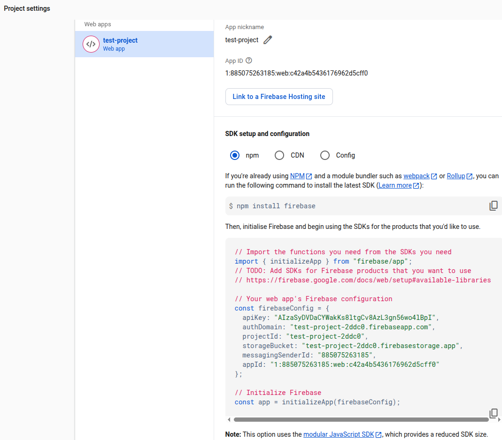

3. Go to the Build -> Authentication and choose the Google provider.

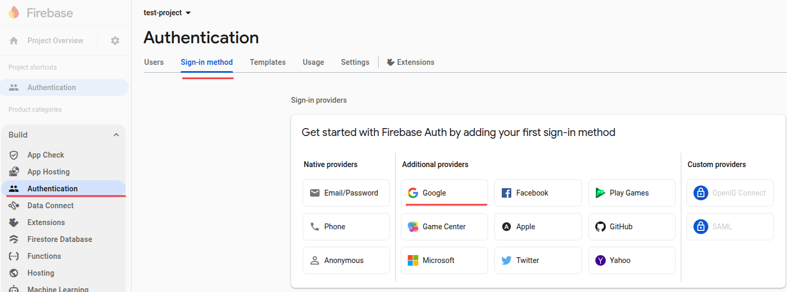

Select `Enable` and fill in `Support email for project` field.

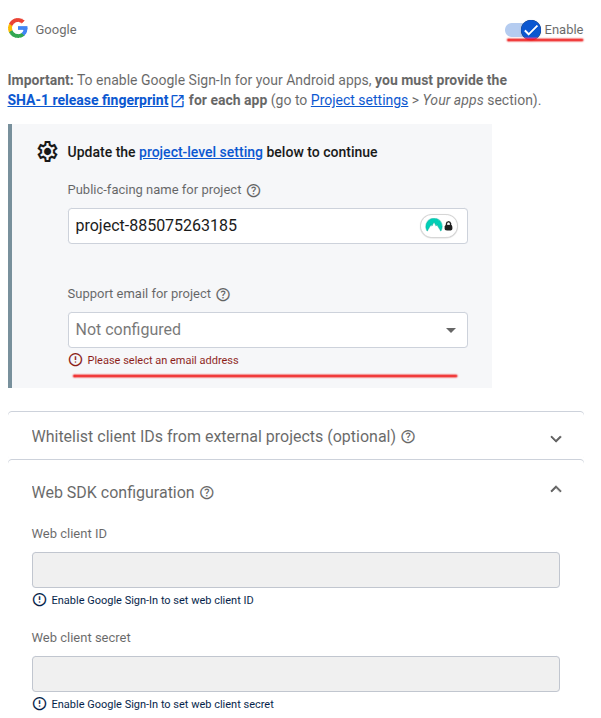

Save changes. The new sign-in provider will be added to your project.

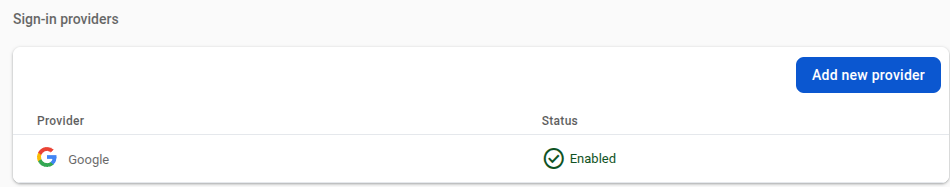

## Setup Firestore

Select `Firestore Database` from the right side panel.

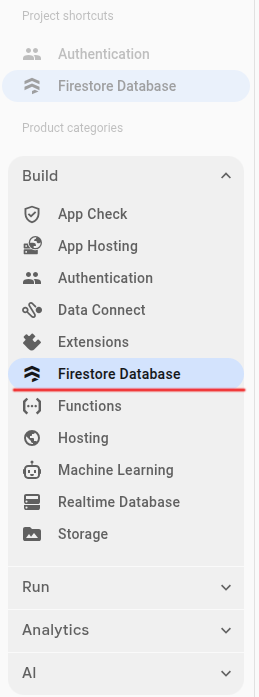

Press `Create database`

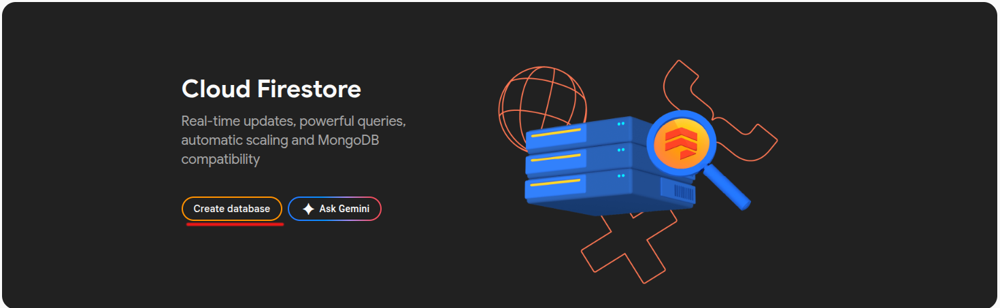

Choose 'Standard edition'

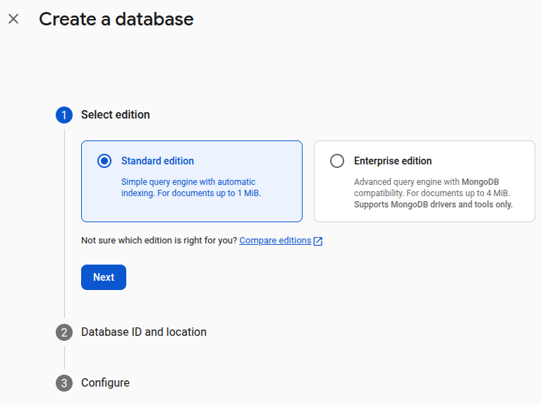

Choose a preferrable location.


Choose any mode, it does not matter for now. We will update rules further.

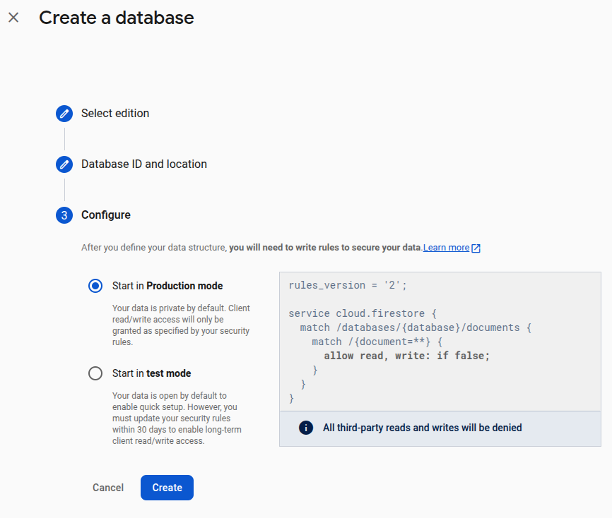

The new firestore database will be created and visible.

## Authentication

### Add authorised domain

Add domain needsly.github.io to the OAuth redirect domains list in the Firebase console -> Authentication -> Settings -> Authorized domains tab.

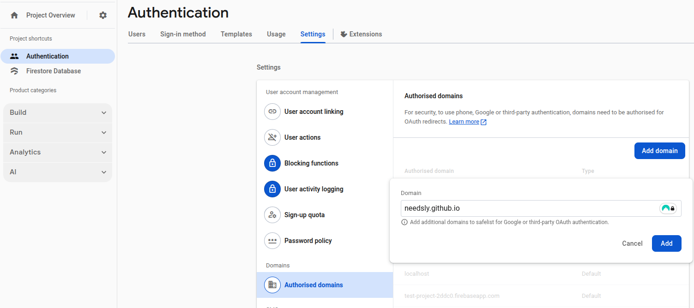

### Update access rules

Go to Firestore Database -> Rules. The default rules is displayed there. Replace it with the next rules (keep wildcards):

```
rules_version = '2';

service cloud.firestore {
  match /databases/{database}/documents {
    match /{document=**} {
      allow read, write: if request.auth != null &&
                         exists(/databases/$(database)/documents/allowed_users/$(request.auth.token.email));
    }
  }
}
```

### Add the owner email to allowed users collection

Open Firestore Database -> Data tab and create a new collection `allowed_users`. Add a document with the name equal to the project owner email (basically it's an email of the current authorized user the whole setup are currently being done). Another way is to add it as access rules condition. Thus, access will be only restricted to explicitly defined users.

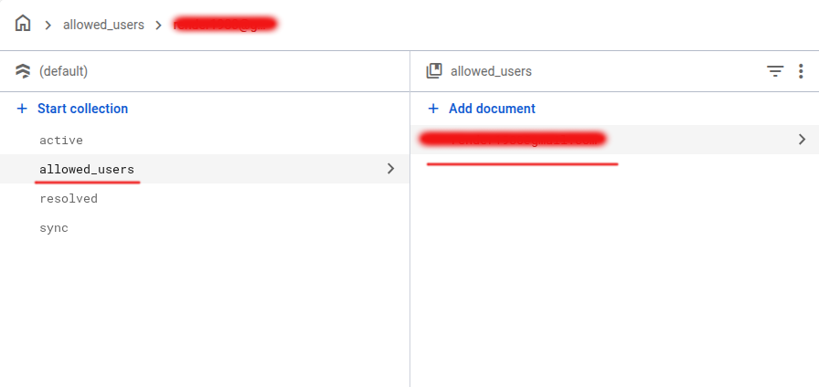

## Create a new shared project in Needsly

1. Open https://needsly.github.io and go to `Shared` tab
2. Type in a new project name (can be any name) in the field `Add shared project`. Press a heavy-plus-sign button to the right.
3. The screen with project settings will be opened. There are five fields:
- Project Id
- API Key
- Appp ID
- Messaging Sender ID
- Auth Domain

Copypaste related values from the Firebase project settings (created previously) and press `Save` button. You will be redirected back to the `Shared Projects` screen where the new shared project can be found.

Click on the newly created shared project. `Sign in with Google` screen will appear.

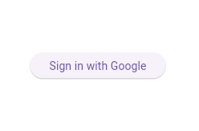

Press the `Sign in with Google` button. The popup with a sign-in via goggle will be opened. Choose your google account and press `Continue`.

Finally, you will see the Shared documents page where it is possible to create and update documents and items. All modifications will be synced via Firestore.

## Add a new shared project member

The goal of Shared Projects is to keep different users synced. If you want to add collaborators, use the button `Share access with` on the top right.
After that the added member can create a new shared project in their browser by specifying project all required project settings (see [Create a new shared project](#create-a-new-shared-project-in-needsly)).

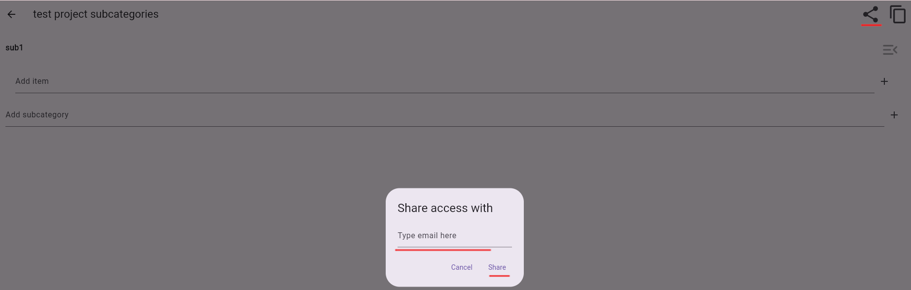

> Be aware that shared projects info is only stored in the browser of one device where setup has been done. Data is not synced across user devices. If you need to have data on other devices, similar setup should be done for every device.>